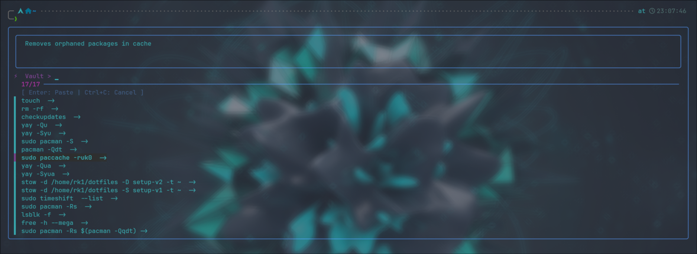

# XC-Manager 
VERSION = 0.2.1-beta



A high-performance, dependency-free Zsh vault for managing complex commands.

What's New in v0.2.1:

## Features
- **Instant Loading**: Uses Zsh `autoload` for near-zero impact on shell startup time.
- **Professional TUI**: Clean command list with a dedicated description preview window.
- **Pure Zsh**: No `awk`, `sed`, or external dependencies.
- **Customizable**: Full support for `zstyle` themes and separators.

## Features
* **Proactive Saving**: Run a command and save it immediately.
* **Retroactive Saving**: Save the last command you ran without retyping it.
* **FZF Integration**: Search your vault with fuzzy finding and live previews.
* **Ligature Friendly**: Uses standard ASCII `->` that renders as a sleek arrow in Nerd Fonts.

## Requirements:

**zsh**

**fzf**

## Installation:

1. Clone this repo:
 
```zsh
git clone https://github.com/Rakosn1cek/xc-manager.git
```

2. Add this line to your ~/.zshrc:

```zsh
# Add to function path and autoload
fpath=(~/arch-projects/XC-Manager/autoload $fpath)
autoload -Uz xc fzf-vault-widget

# Initialize the widget
zle -N fzf-vault-widget
bindkey '^G' fzf-vault-widget
```

## HISTORY SETTINGS (Ensures 'xc' can see previous commands)

```zsh
HISTFILE=~/.zsh_history
HISTSIZE=10000
SAVEHIST=10000
setopt appendhistory
```
### Reload your shell:

```zsh
source ~/.zshrc
```

3. Initialize the vault (First time only):
```zsh
xc init
```

5. Configuration (Optional)
You can customize the look of your vault using Zsh's zstyle system:
Customize FZF colors

```zsh
zstyle ':xc:*' fzf_colors "gutter:-1,border:8,header:4,info:2,pointer:5,marker:13,fg+:7,prompt:5,hl:12"
```

## Usage:

6. Save the command you JUST ran (Recommended)
Just run any command as usual. If it works and you want to keep it, just type:

```zsh
xc
```
7. Run and Save at once
Save a specific command directly:

```zsh
xc <command>
```

8. Retrieving a command:

Press Ctrl + G anywhere in your terminal.

Use the arrow keys or type to filter.

The description appears in the preview box at the top.

Press Enter to load the command into your prompt.

9. Check version

```zsh
xc -v
```
 
## License

Distributed under the MIT License. See LICENSE for more information.

### Changelog
**v0.2.1-betta (current)**

Instant Loading. Uses Zsh `autoload` for near-zero impact on shell startup time.

Professional TUI. Clean command list with a dedicated description preview window.

Pure Zsh. No `awk`, `sed`, or external dependencies.

Full support for `zstyle` themes and separators.

**v0.1.1-beta**

Refined TUI: Implemented fzf delimiters for a cleaner list view.

Smart Previews: Added a top-window preview showing only the description using native Zsh string expansion.

Styling Hook: Added zstyle support for custom separators and fzf color schemes.

Dependency-Free: Removed all external tool requirements (awk/sed) in favor of pure Zsh logic.

Bug Fix: Resolved an issue where commands with multiple spaces were being truncated in the preview.

**v0.1.0-alpha**

Initial Release: Basic command vaulting and history integration.

FZF Integration: Basic fuzzy search for stored commands.

### Roadmap

[ ] Native Delete Feature: Implement a keybinding (e.g., Alt+D) to remove entries directly from the FZF interface without opening the vault file.

[ ] Vault Cleanup: A command to remove duplicate entries or empty descriptions automatically.

[ ] Multi-Vault Support: Ability to switch between different vault files (e.g., work, personal, hyprland).

[ ] Export to Alias: A way to export a frequently used vault command directly to your .zshrc as a permanent alias.
