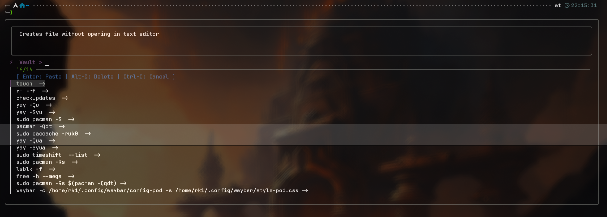

# XC-Manager 
VERSION = 0.2.3-beta



A high-performance, dependency-free Zsh vault for managing complex commands.

## New in v0.2.3-beta

The Time Machine (xc select): Added a history selector. You can now pick from your last 100 commands using fzf if you forgot to save a command immediately.

Intelligent Cleanup (xc clean): A new maintenance command that identifies and removes exact duplicates and "ghost" entries (commands without descriptions).

Transparent Logging: The cleanup process now prints exactly what it is removing, so you never lose data by accident.

## Features
* **Proactive Saving**: Run a command and save it immediately.
* **Retroactive Saving**: Save the last command you ran without retyping it.
* **FZF Integration**: Search your vault with fuzzy finding and live previews.
* **Ligature Friendly**: Uses standard ASCII `->` that renders as a sleek arrow in Nerd Fonts.
* **Zero-Lag**: Uses Zsh autoload for near-instant shell startup.
* **Smart History**: Save the last command or select from your recent history.
* **Fuzzy Search**: Instant TUI with command previews via fzf.
* **Safe Maintenance**: Built-in transparent cleanup for duplicates.
* **Distro Agnostic**: Works on Arch, Fedora, Debian, and macOS.

## Requirements:

* **zsh**
* **fzf**

## Installation:

1. Clone this repo:
 
```zsh
git clone https://github.com/Rakosn1cek/xc-manager.git
```

2. Add this line to your ~/.zshrc:

```zsh
# Add to function path and autoload
fpath=(~/arch-projects/XC-Manager/autoload $fpath)
autoload -Uz xc fzf-vault-widget

# Initialize the widget
zle -N fzf-vault-widget
bindkey '^G' fzf-vault-widget
```

## HISTORY SETTINGS (Ensures 'xc' can see previous commands)

```zsh
HISTFILE=~/.zsh_history
HISTSIZE=10000
SAVEHIST=10000
setopt appendhistory
```
### Reload your shell:

```zsh
source ~/.zshrc
```

3. Initialize the vault (First time only):
```zsh
xc init
```

5. Configuration (Optional)
You can customize the look of your vault using Zsh's zstyle system:
Customize FZF colors

```zsh
zstyle ':xc:*' fzf_colors "gutter:-1,border:8,header:4,info:2,pointer:5,marker:13,fg+:7,prompt:5,hl:12"
```

## Usage:

6. Save the command you JUST ran (Recommended)
Just run any command as usual. If it works and you want to keep it, just type:

```zsh
xc
```
7. Search your last 100 commands to save one.
```zsh
xc select
```
8. Scrub duplicates and empty entries from the vault.
```
xc clean
```
9. Retrieving a command:

Press Ctrl + G anywhere in your terminal.

Use the arrow keys or type to filter.

The description appears in the preview box at the top.

Press Enter to load the command into your prompt.

10. Check version
```zsh
xc -v
```
11. (Inside Vault) Delete selected entry.
```zsh
Alt + D: 
``` 

## License

Distributed under the MIT License. See LICENSE for more information.

### Changelog
For a detailed history of changes and version milestones, please see [CHANGELOG.md](./CHANGELOG.md).

### Roadmap
[x] Modular Architecture: Refactored to Zsh `autoload` for instant startup.

[x] Native Delete Feature: Implement a keybinding (e.g., Alt+D) to remove entries directly from the FZF interface without opening the vault file.

[x] Vault Cleanup: A command to remove duplicate entries or empty descriptions automatically.

[ ] Multi-Vault Support: Ability to switch between different vault files (e.g., work, personal, hyprland).

[ ] Export to Alias: A way to export a frequently used vault command directly to your .zshrc as a permanent alias.
